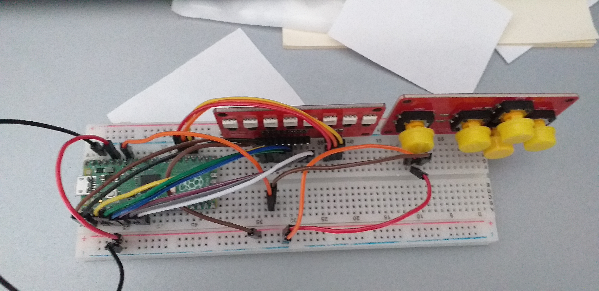
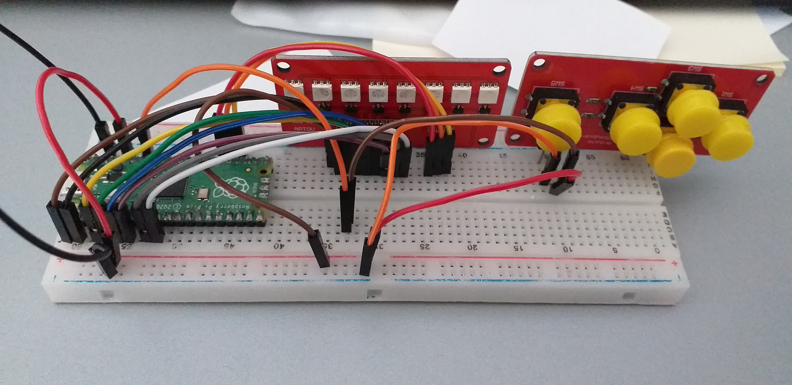

# Memory-game-for-Raspberry-Pico
Memory game for Raspberry Pico with ADKeyboard and led RGB V2

Memory Game : push corresponding switch (1,4 and 5) to reproduce the sequence shown by the leds.
switches 2 and 3 to reset the game.
green flashing : show the sequence to reproduce

blue flashing : the player reproduces the sequence

red flashing : wrong sequence - game restarts

I have not found an easy way to make a nice picture (I have not found the ADkeyboard and the led component for fritzing)
Connections:
LED RGB V2 : I connected the D0 to the D7 to the pins 1 to 8 on the Pico, the RGB pins to the 18, 19,20 pins and the VCC to the VCC

ADKeyboard :  I connected the out to the pin 28 and VCC and out to the corresponding pin

the game is in Pyhton, not an optimized code but works for now

To do :

optimize code

comment code

